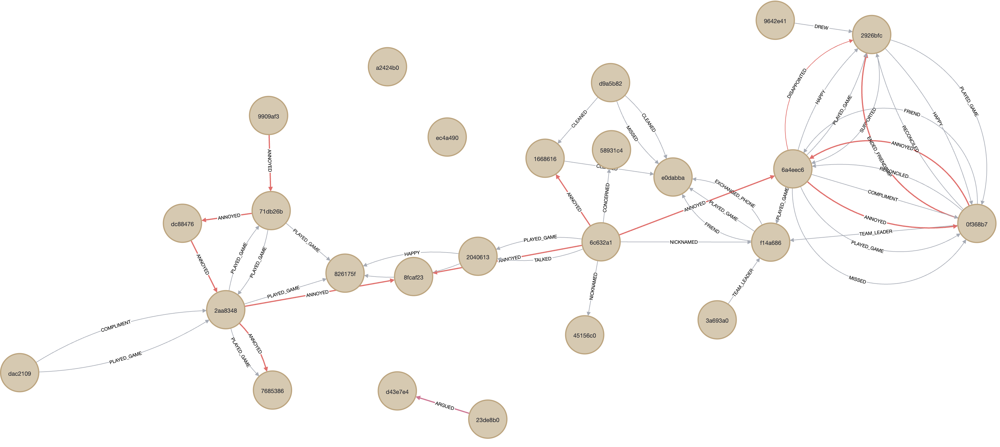
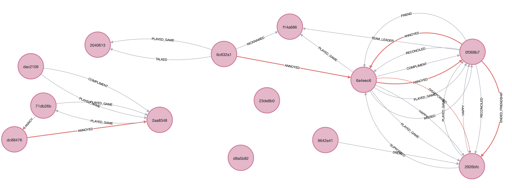

# NLP and LLM-based Analysis of Student Emotion Diaries

## Project Story
The aim of this project is to analyze students' handwritten emotion diaries and provide personalized feedback based on the results. 
This year, a third-grade homeroom teacher, I noticed that my students often got into conflicts and showed strong emotional reactions. I believe that keeping a diary is a powerful way for students to be honest with themselves and to build a private channel of communication between teachers and students. By using emotion diaries, I aim to better understand their emotional states and peer relationships, ultimately supporting their personal growth. Technically, the project focuses on NLP and LLM techniques, including sentiment analysis with BERT and prompt engineering to extract targeted insights. Additionally, Neo4j was used to figure out nuanced relationship and Streamlit were used to visualize outcomes, making the project more intuitive and engaging.

## Repository Contents
- **data** :
  - `Handwritten_diary_sample` : Handwritten diary data sample
  - `diary_sample.csv` : Sample of dataframe containing around 250 diary entries  
- **notebook**
  - `Analysis_of_Student_Emotion_Diaries.ipynb` : Notebook for analysis and modeling. 
- **deployment**:
   - `emotion_calendar.py`: Generates the emotion calendar
   - `emotion_graph.py`: Generates the emotion graph

  
## Strategies flow
- **Data Preprocessing**
  - **OCR and creating dataframe** : Using Google AI Studio, transform diaries into text datasets and create a dataframe with dataset information.
- **Personal data encryption** : To protect privacy, encrypt students' names by replacing them with nicknames.
- **Data analysis** : Using Neo4j (graph database system), analyze subtle changes in students' friendships and check their relationship status.(The detailed insights of graph can be found in the notebook)
  

  

<em>Graph1 drawn based on all students mentioned in the diary texts</em>

  

<em>Graph2 for students who mentioned other students' names in their diaries</em>

- **Modeling**
  - **Pseudo labeling** : For unlabeled datasets, apply the "sangrimlee/bert-base-multilingual-cased-nsmc" model with the emotion column, and correct mislabeled data.
  - **Sentiment Analysis with BERT** : Perform sentiment analysis using both a pre-trained model and a fine-tuned model ("beomi/KcELECTRA-base"), then compare the results.
    

  
| Model        | Accuracy | F1 Score | Precision | Recall |
|--------------|----------|----------|-----------|--------|
| Pretrained   | 0.43     | 0.06     | 1.0       | 0.03   |
| Fine-tuned   | 0.58     | 0.74     | 0.58      | 1.0    |

- **Generating emotion calendar**
  - **LLM-Prompt engineering** : Extract sentiment scores and find causes of the emotion status to give constructive feedback to students.
  - **Sreamlit** : Using Streamlit, build an emotional tracking calendar and graph demo to visualize results.
    

  

